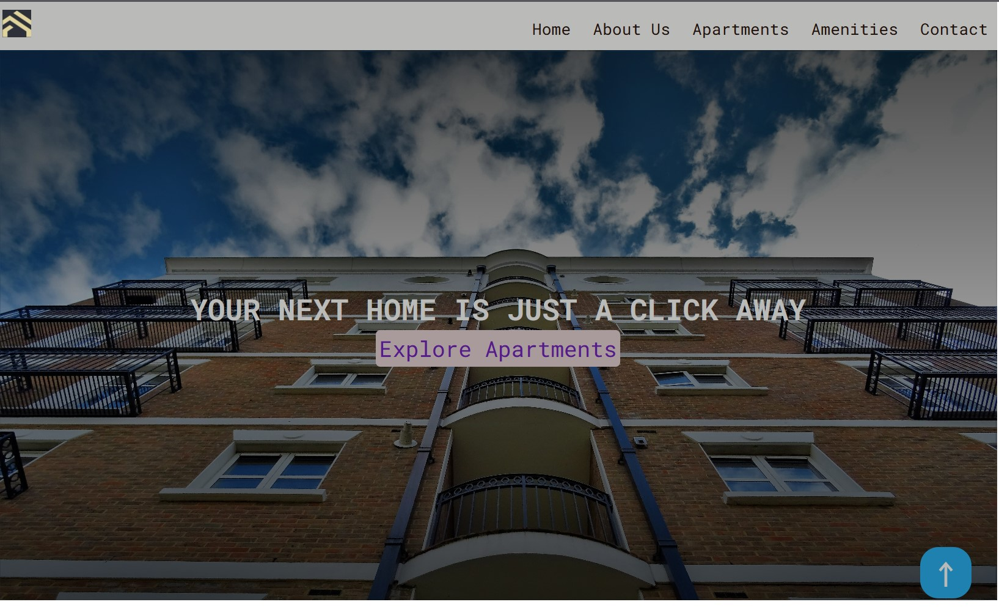
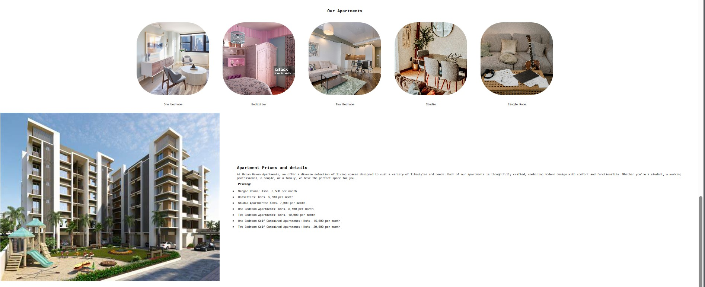

# Urban Haven Apartments Website

A responsive website for Urban Haven Apartments that provides information about available living spaces, amenities, and contact options. The design adapts to different screen sizes using media queries to ensure a seamless user experience on desktops, tablets, and mobile devices.

## Table of Contents
- [Features](#features)
- [Screenshots](#screenshots)
- [Technologies Used](#technologies-used)
- [Installation](#installation)
- [Usage](#usage)666666
- [Contributing](#contributing)

## Features
- Responsive navigation bar with a logo and links to different sections.
- Hero section with a background image and centered text.
- About Us section detailing information about the apartments, stacked in a column format on smaller screens.
- Amenities section listing available facilities with images.
- Apartment listings with images and pricing details.
- Contact Us section including a form and contact information.
- Footer with social media icons and credits.

## Screenshot

### 1. Hero Section


### 2. About Us Section


### 3. Amenities Section


### 4. Our Apartments Section


## Technologies Used
- **HTML5**: Markup language for structuring content.
- **CSS**: Styles for layout and design.
- **Responsive Design**: Media queries for adjusting layout on different devices.

## Installation
1. Clone the repository:
    ```bash
    git clone https://github.com/your-username/urban-haven-apartments.git
    ```
2. Navigate into the project directory:
    ```bash
    cd urban-haven-apartments
    ```
3. Open the `index.html` file in your preferred browser:
    ```bash
    open index.html
    ```

## Usage
- Open the website in a browser to view the various sections, including Home, About Us, Amenities, Apartments, and Contact.
- Resize the browser window to see the responsive design in action.
- Navigate through different sections using the navigation bar.

## Contributing
Contributions are welcome! Please follow these steps to contribute:
1. Fork the repository.
2. Create a new branch:
    ```bash
    git checkout -b feature-branch-name
    ```
3. Make your changes and commit them:
    ```bash
    git commit -m "Add a new feature"
    ```
4. Push to the branch:
    ```bash
    git push origin feature-branch-name
    ```
5. Open a pull request on GitHub.
